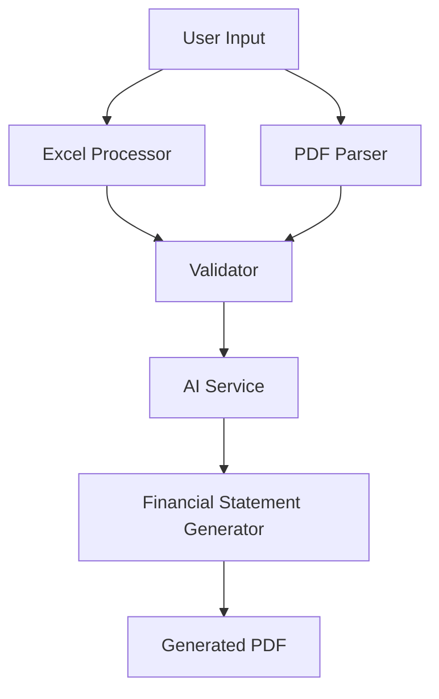

# Enhanced System Development for AASB-Compliant Financial Statement Generator

## 1. Overview

This design document outlines the enhancements to the AASB-compliant financial statement generator to improve PDF parsing, Excel processing, and validation capabilities. The system currently generates financial statements for Australian non-reporting entities in accordance with AASB 101, AASB 108, and AASB 1048 standards.

### 1.1 Current System Capabilities

The existing system provides:
- Web-based GUI with drag-and-drop file uploads
- Excel processing for financial data extraction
- PDF parsing for prior year data and structure
- AI-powered validation using OpenRouter API
- Generation of complete financial statements including:
  - Statement of Profit or Loss and Other Comprehensive Income
  - Statement of Financial Position (Balance Sheet)
  - Notes to Financial Statements
  - Directors' Declaration
  - Independent Compilation Report

### 1.2 Enhancement Goals

The enhancements will focus on:
1. Improving PDF parsing accuracy and robustness
2. Enhancing Excel data extraction capabilities
3. Strengthening validation checks with more comprehensive rules
4. Expanding AI-powered features for better accuracy
5. Improving error handling and user feedback
6. Adding user-configurable OpenRouter API key input in GUI
7. Implementing Qwen/Qwen3-Embedding-8B model for advanced document analysis

## 2. System Architecture

### 2.1 Component Overview

The system consists of the following core components:

1. **Excel Processor** (`excel_processor.py`) - Extracts financial data from Excel files
2. **PDF Parser** (`pdf_parser.py`) - Extracts data and structure from PDF documents
3. **Financial Statement Generator** (`aasb_financial_statement_generator.py`) - Creates PDF financial statements
4. **Validator** (`validator.py`) - Performs validation checks before generation
5. **AI Service** (`ai_service.py`, `ai_service_enhanced.py`) - Provides AI-powered validation and enhancement
6. **GUI Application** (`gui_app.py`) - Web interface for user interaction
7. **Main Application** (`main.py`) - Command-line interface

### 2.2 Data Flow

## 3. Enhancement Requirements

### 3.1 PDF Parsing Improvements

#### 3.1.1 Enhanced Text Extraction
- Implement more robust PDF text extraction to handle complex layouts
- Improve handling of tables and structured data in PDFs
- Add support for different PDF encoding formats

#### 3.1.2 Improved Data Recognition
- Enhance pattern matching for financial line items
- Add support for alternative terminology (e.g., "revenue" vs "sales")
- Implement fuzzy matching for similar terms

#### 3.1.3 Better Structure Detection
#### 3.4.3 Intelligent Data Extraction
- Improve AI-powered PDF data extraction
- Implement context-aware data interpretation
- Add support for complex financial document structures
- Integrate Qwen/Qwen3-Embedding-8B model for advanced document analysis and semantic understanding