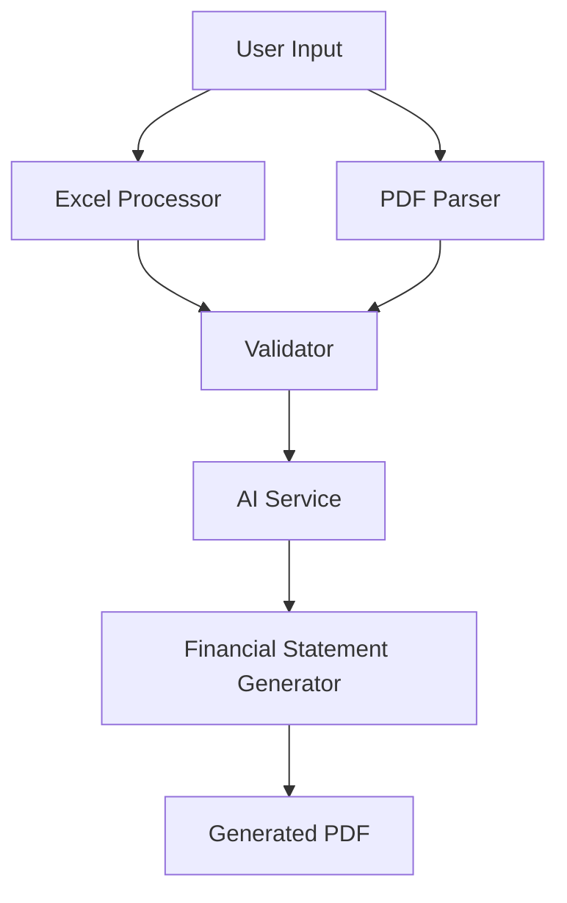

# Enhanced System Development for AASB-Compliant Financial Statement Generator

## 1. Overview

This design document outlines the enhancements to the AASB-compliant financial statement generator to improve PDF parsing, Excel processing, and validation capabilities. The system currently generates financial statements for Australian non-reporting entities in accordance with AASB 101, AASB 108, and AASB 1048 standards.

### 1.1 Current System Capabilities

The existing system provides:
- Web-based GUI with drag-and-drop file uploads
- Excel processing for financial data extraction
- PDF parsing for prior year data and structure
- AI-powered validation using OpenRouter API
- Generation of complete financial statements including:
  - Statement of Profit or Loss and Other Comprehensive Income
  - Statement of Financial Position (Balance Sheet)
  - Notes to Financial Statements
  - Directors' Declaration
  - Independent Compilation Report

### 1.2 Enhancement Goals

The enhancements will focus on:
1. Improving PDF parsing accuracy and robustness
2. Enhancing Excel data extraction capabilities
3. Strengthening validation checks with more comprehensive rules
4. Expanding AI-powered features for better accuracy
5. Improving error handling and user feedback
6. Adding user-configurable OpenRouter API key input in GUI
7. Implementing Qwen/Qwen3-Embedding-8B model for advanced document analysis

## 2. System Architecture

### 2.1 Component Overview

The system consists of the following core components:

1. **Excel Processor** (`excel_processor.py`) - Extracts financial data from Excel files
2. **PDF Parser** (`pdf_parser.py`) - Extracts data and structure from PDF documents
3. **Financial Statement Generator** (`aasb_financial_statement_generator.py`) - Creates PDF financial statements
4. **Validator** (`validator.py`) - Performs validation checks before generation
5. **AI Service** (`ai_service.py`, `ai_service_enhanced.py`) - Provides AI-powered validation and enhancement
6. **GUI Application** (`gui_app.py`) - Web interface for user interaction
7. **Main Application** (`main.py`) - Command-line interface

### 2.2 Data Flow

## 3. Enhancement Requirements

### 3.1 PDF Parsing Improvements

#### 3.1.1 Enhanced Text Extraction
- Implement more robust PDF text extraction to handle complex layouts
- Improve handling of tables and structured data in PDFs
- Add support for different PDF encoding formats

#### 3.1.2 Improved Data Recognition
- Enhance pattern matching for financial line items
- Add support for alternative terminology (e.g., "revenue" vs "sales")
- Implement fuzzy matching for similar terms

#### 3.1.3 Better Structure Detection
- Improve section identification (income statement, balance sheet, notes)
- Enhance note numbering and heading detection
- Add support for nested note structures

### 3.2 Excel Processing Enhancements

#### 3.2.1 Flexible Sheet Recognition
- Expand supported sheet names beyond "Consol PL" and "Consol BS"
- Implement pattern-based sheet detection
- Add support for multiple sheet formats

#### 3.2.2 Improved Data Extraction
- Enhance numeric value extraction with better formatting handling
- Add support for currency conversion
- Implement more robust error handling for malformed data

#### 3.2.3 Data Validation
- Add pre-processing validation of Excel data
- Implement data type checking
- Add range validation for financial figures

### 3.3 Validation Improvements

#### 3.3.1 Enhanced Financial Validation
- Implement more comprehensive balance sheet validation rules
- Add cash flow statement validation (if applicable)
- Strengthen retained earnings roll-forward validation

#### 3.3.2 Compliance Checking
- Add AASB standard-specific validation rules
- Implement cross-reference checking between statements
- Add disclosure completeness validation

#### 3.3.3 Error Reporting
- Improve error message clarity and specificity
- Add detailed diagnostic information
- Implement hierarchical error classification

### 3.4 AI-Powered Enhancements

#### 3.4.1 Model Selection Flexibility
- Allow users to select different AI models for different tasks
- Implement model performance monitoring
- Add automatic model selection based on task complexity
- Enable user-configurable OpenRouter API key input in GUI

#### 3.4.2 Enhanced Validation Capabilities
- Expand AI validation to cover more financial relationships
- Implement natural language processing for note content analysis
- Add consistency checking between different data sources

#### 3.4.3 Intelligent Data Extraction
- Improve AI-powered PDF data extraction
- Implement context-aware data interpretation
- Add support for complex financial document structures
- Integrate Qwen/Qwen3-Embedding-8B model for advanced document analysis and semantic understanding

## 4. Detailed Design

### 4.1 PDF Parser Enhancements

#### 4.1.1 Text Extraction Improvements
The PDF parser will be enhanced with:
- Advanced layout analysis to handle multi-column documents
- Improved handling of rotated text and embedded fonts
- Better whitespace and line break detection

#### 4.1.2 Data Recognition Enhancement
Enhancements to data recognition will include:
- Regular expression libraries for common financial terms
- Synonym mapping for financial terminology
- Context-aware term recognition

#### 4.1.3 Structure Detection Improvements
Structure detection will be enhanced with:
- Machine learning models for section classification
- Template-based recognition for common document formats
- Hierarchical structure analysis

### 4.2 Excel Processor Enhancements

#### 4.2.1 Sheet Recognition
The Excel processor will be enhanced with:
- Fuzzy matching for sheet names
- Content-based sheet type detection
- Support for multiple sheet formats per document type

#### 4.2.2 Data Extraction Improvements
Data extraction enhancements will include:
- Advanced numeric parsing with currency detection
- Date format recognition and conversion
- Error correction for common data entry mistakes

#### 4.2.3 Validation Framework
A new validation framework will be implemented:
- Configurable validation rules
- Real-time validation during data extraction
- Detailed validation reporting

### 4.3 Validator Enhancements

#### 4.3.1 Financial Validation Rules
New validation rules will include:
- Ratio analysis for financial health indicators
- Trend analysis for comparative figures
- Industry benchmarking (where applicable)

#### 4.3.2 Compliance Validation
Compliance validation will be enhanced with:
- AASB standard-specific rule engines
- Disclosure requirement checking
- Cross-statement consistency validation

#### 4.3.3 Error Handling
Error handling improvements will include:
- Granular error categorization
- Suggested corrections for common errors
- Integration with AI for error explanation

### 4.4 AI Service Enhancements

#### 4.4.1 Model Management
The AI service will be enhanced with:
- Dynamic model selection based on task requirements
- Model performance tracking and comparison
- Fallback mechanisms for model failures

#### 4.4.2 Validation Intelligence
AI validation will be enhanced with:
- Deep learning models for financial pattern recognition
- Natural language understanding for note analysis
- Anomaly detection for unusual financial patterns

#### 4.4.3 Data Processing
Data processing capabilities will be enhanced with:
- Multi-modal processing for complex documents
- Context-aware data interpretation
- Confidence scoring for AI-generated results
- Integration of Qwen/Qwen3-Embedding-8B model for semantic document analysis

## 5. Implementation Plan

### 5.1 Phase 1: PDF Parsing Improvements (Weeks 1-2)
- Implement advanced text extraction algorithms
- Enhance data recognition patterns
- Improve structure detection capabilities

### 5.2 Phase 2: Excel Processing Enhancements (Weeks 3-4)
- Expand sheet recognition capabilities
- Improve data extraction accuracy
- Implement validation framework

### 5.3 Phase 3: Validation Improvements (Weeks 5-6)
- Implement enhanced financial validation rules
- Add compliance checking capabilities
- Improve error reporting mechanisms

### 5.4 Phase 4: AI-Powered Enhancements (Weeks 7-8)
- Enhance model selection flexibility
- Implement intelligent validation capabilities
- Improve data processing algorithms
- Integrate Qwen/Qwen3-Embedding-8B model for document analysis

## 6. Testing Strategy

### 6.1 Unit Testing
- Develop comprehensive unit tests for each enhanced component
- Implement test cases for edge cases and error conditions
- Add performance benchmarks for critical functions

### 6.2 Integration Testing
- Test integration between enhanced components
- Validate data flow between modules
- Test error handling across component boundaries

### 6.3 User Acceptance Testing
- Conduct usability testing with sample financial documents
- Validate accuracy of enhanced features
- Gather feedback for further improvements

## 7. Risk Assessment

### 7.1 Technical Risks
- Complexity of PDF layout analysis
- Accuracy of AI-powered validation
- Performance impact of enhanced features

### 7.2 Mitigation Strategies
- Implement incremental improvements with thorough testing
- Provide fallback mechanisms for AI failures
- Optimize performance-critical code paths

## 8. Success Metrics

### 8.1 Quantitative Metrics
- Improvement in PDF parsing accuracy (target: 95%+)
- Reduction in manual corrections needed (target: 50% reduction)
- Increase in processing speed (target: 20% improvement)

### 8.2 Qualitative Metrics
- User satisfaction with enhanced features
- Reduction in error reports
- Improvement in generated document quality

## 9. Conclusion

The proposed enhancements will significantly improve the capabilities of the AASB-compliant financial statement generator. By focusing on PDF parsing, Excel processing, validation, and AI-powered features, the system will become more robust, accurate, and user-friendly. The phased implementation approach will ensure that each enhancement is thoroughly tested and validated before moving to the next phase.